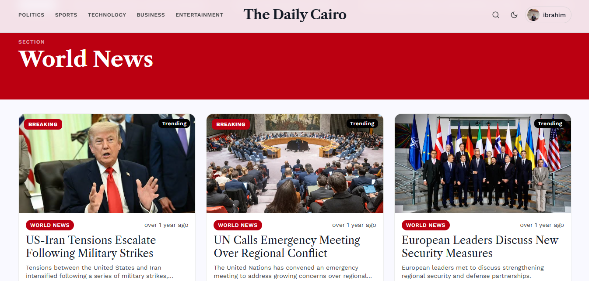
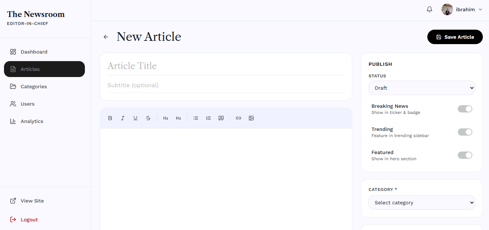

# 📰 The Daily Cairo — News Platform

A modern full-stack news platform built with React 18, TypeScript, Laravel 12, MySQL, and Laravel Sanctum.

> 📸 Project Preview
>
> 
> 
> 
> 

---


---

## 📖 Table of Contents

* [✨ Features](#-features)
* [🛠️ Tech Stack](#️-tech-stack)
* [🛡️ Security](#️-security)
* [🚀 Installation](#-installation)
* [🤝 Contributing](#-contributing)
* [📜 License](#-license)

---

## ✨ Features

* 📰 Complete digital news platform with categories, articles, comments, and bookmarks.
* 🔥 Breaking news, trending articles, and featured content sections.
* 🔍 Advanced article search and filtering.
* 👤 Authentication powered by Laravel Sanctum Bearer Tokens.
* 🛡️ Role-based access system (Admin, Editor, User).
* 📚 Reading history and bookmark management.
* 🔔 User notifications and profile management.
* ✍️ Rich article editor with image uploads.
* 📊 Admin analytics dashboard.
* 🌙 Dark / Light mode support.
* 🌍 Fully responsive design.
* ⚡ RESTful API architecture.
* 🔒 Secure protected routes and permissions.

---

## 🛠️ Tech Stack

| Layer            | Technology                  |
| ---------------- | --------------------------- |
| Frontend         | React 18 + TypeScript       |
| Styling          | Tailwind CSS                |
| State Management | Zustand                     |
| Routing          | React Router                |
| HTTP Client      | Axios                       |
| Backend          | Laravel 12                  |
| Authentication   | Laravel Sanctum             |
| Database         | MySQL 8                     |
| Search           | Laravel Scout + Meilisearch |
| Editor           | Tiptap                      |
| Authorization    | Spatie Permissions          |
| Icons            | Font Awesome 6              |

---

## 🚀 Installation

### Backend

```bash
cd backend

composer install

cp .env.example .env

php artisan key:generate

php artisan migrate --seed

php artisan storage:link

php artisan serve
```

Backend URL:

```text
http://localhost:8000
```

### Frontend

```bash
cd frontend

npm install

npm run dev
```

Frontend URL:

```text
http://localhost:5173
```

---

## 🛡️ Security

| Concern          | Implementation                |
| ---------------- | ----------------------------- |
| Authentication   | Laravel Sanctum Bearer Tokens |
| Authorization    | Spatie Role & Permission      |
| Password Hashing | Laravel Hash/Bcrypt           |
| Input Validation | Laravel Validation Rules      |
| SQL Injection    | Eloquent ORM                  |
| XSS Protection   | React Escaping                |
| API Security     | Protected Routes              |
| CORS             | Configurable CORS Policies    |


---

## 🤝 Contributing

Contributions are welcome.

Please read the Contributing Guide before opening a Pull Request.

---

## 📜 License

This project is licensed under the MIT License.
# 📰 The Daily Cairo — News Platform

A modern full-stack digital news platform built with React 18, Laravel 12, MySQL, and Laravel Sanctum.

> 📸 Project Preview
>
> 
> 
> 

---


---

## 📖 Table of Contents

* [✨ Features](#-features)
* [🛠️ Tech Stack](#️-tech-stack)
* [🛡️ Security](#️-security)
* [🚀 Installation](#-installation)
* [🤝 Contributing](#-contributing)
* [📜 License](#-license)

---

## ✨ Features

* 📰 Complete news platform with articles, categories, comments, and bookmarks.
* 🔐 Secure authentication using Laravel Sanctum Bearer Tokens.
* 👤 Multi-role architecture (Admin, Editor, User).
* ✍️ Rich article editor with image uploads and publishing tools.
* 📊 Advanced admin dashboard with analytics and content management.
* 🔥 Breaking News, Trending Articles, and Featured Stories sections.
* 🔍 Fast article search with Laravel Scout and Meilisearch support.
* ❤️ Bookmark system and reading history tracking.
* 🔔 User notifications and profile management.
* 🌙 Dark / Light mode support.
* 📱 Fully responsive design for mobile, tablet, and desktop.
* ⚡ RESTful API architecture with structured JSON responses.
* 🛡️ Protected routes and role-based authorization.
* 🌍 Modern news experience with category-based navigation.

---

## 🛠️ Tech Stack

| Layer            | Technology                  |
| ---------------- | --------------------------- |
| Frontend         | React 18 + TypeScript       |
| Styling          | Tailwind CSS                |
| State Management | Zustand                     |
| Data Fetching    | TanStack Query              |
| Routing          | React Router                |
| HTTP Client      | Axios                       |
| Backend          | Laravel 12                  |
| Authentication   | Laravel Sanctum             |
| Authorization    | Spatie Permissions          |
| Database         | MySQL 8                     |
| Search           | Laravel Scout + Meilisearch |
| Editor           | Tiptap                      |
| Icons            | Font Awesome 6              |

---

## 🚀 Installation

### Backend

```bash
cd backend

composer install

cp .env.example .env

php artisan key:generate

php artisan migrate --seed

php artisan storage:link

php artisan serve
```

Backend URL:

```text
http://localhost:8000
```

### Frontend

```bash
cd frontend

npm install

npm run dev
```

Frontend URL:

```text
http://localhost:5173
```

---

## 🛡️ Security

| Concern          | Implementation                |
| ---------------- | ----------------------------- |
| Authentication   | Laravel Sanctum Bearer Tokens |
| Authorization    | Spatie Role & Permission      |
| Password Hashing | Laravel Hash/Bcrypt           |
| Input Validation | Laravel Validation Rules      |
| SQL Injection    | Eloquent ORM                  |
| XSS Protection   | React Escaping                |
| API Security     | Protected Routes              |
| CORS             | Configurable CORS Policies    |

---

## 🤝 Contributing

Contributions are welcome.

Please read the [Contributing Guide](./Contributing.md) before creating a Pull Request.

---

## 📜 License

This project is licensed under the MIT License.

See the [LICENSE](./LICENSE) file for details.

---

Built with ❤️ by **Ibrahim Elsayed**

© 2026 The Daily Cairo. All Rights Reserved.

See the LICENSE file for details.

---

Built with ❤️ by **Ibrahim Elsayed**

© 2026 The Daily Cairo. All Rights Reserved.
